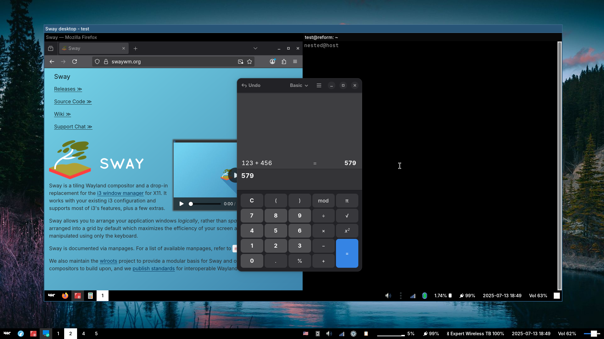
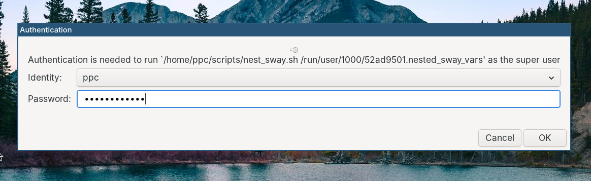
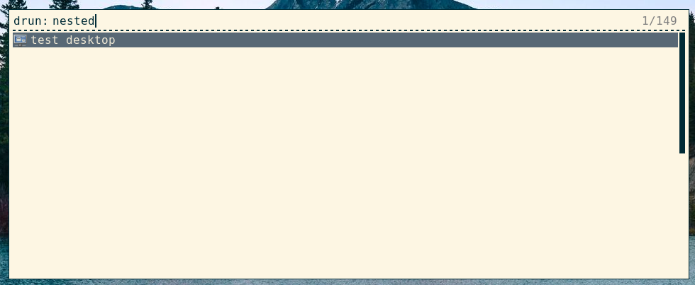

# nest_sway.sh
### Version 1.1

* [Installation](#Installation)
* [Usage](#Usage)
* [Why this script is needed](#Why-this-script-is-needed)
* [License](#License)

Shell script to start a nested Sway (Wayland) session as another user.




## Installation

- Clone this repository **recursively**:

  ```console
  git clone https://github.com/Giraut/nest_sway.git --recurse-submodules
  cd nest_sway
  ```

- Install [filterway](https://github.com/andrewbaxter/filterway):

  ```console
  cd filterway
  cargo build
  sudo install -m 755 target/debug/filterway /usr/bin
  cd ..
  ```

- Copy the `nest_sway.sh` script somewhere in your PATH. I personally put all my scripts in a `~/scripts/` directory:

  ```console
  install -D -m 755 nest_sway.sh ~/scripts/nest_sway.sh
  ```

- By default, `nest_sway.sh` uses [pkexec](https://allthings.how/use-pkexec-sudo-alternative-run-commands-root-linux/) to become root. If you have a graphical polkit agent such as [LXPolkit](https://blog.lxde.org/2010/03/28/lxpolkit-simple-policykit-authentication-agent/), it allows you to enter your password in a popup window and start the nested Sway session without a terminal.

  If you'd rather use the traditional `sudo` command, edit the script and change the `RUN_AS_ROOT_CMD` variable.

- If you use the script with `pkexec` and you'd like to launch a nested session as a particular user from your favorite application launcher, you can create a .desktop file in your local `~/.local/share/applications/` directory.

  For example, to launch a session as user `test`, create `~/.local/share/applications/test-desktop.desktop` with the following content or similar:

  ```
  [Desktop Entry]
  Name=test desktop
  Exec=nest_sway.sh test
  Icon=gnome-remote-desktop
  Type=Application
  Keywords=sway;nest;nested;
  ```


## Usage

### From the terminal

  ```console
  nest_sway.sh <nested session user>
  ```

  If you use the script with `pkexec`, your graphical polkit agent will appear and ask you for your password to become root:

  

  Otherwise `sudo` will ask you in the terminal if needed.

### From your application launcher with a .desktop file

  If you crated a .desktop file as described above, simply launch the application from your application launcher:

  


## Why this script is needed

Sway - or more precisely [wlroots](https://github.com/swaywm/wlroots) - can already run nested natively without any modification. You can test that by opening a terminal and typing `sway` in it: you'll get a second, identical desktop inside your current one, without needing any script.

The problems come when you want to run another user's desktop within yours, for the following reasons:

1. Wayland makes the incredibly restrictive assumption that the Wayland compositor and clients always run as the same user, and therefore puts the Wayland socket in the user's XDG_RUNTIME_DIR (usually `/run/user/<userid>/`).

   That's a problem if you want a Wayland application running as another user to connect to that Wayland socket, because other users can't access your XDG_RUNTIME_DIR. And you really don't want to open it up to other users just to be able to access the socket because it's full of sensitive files pertaining to your running session.

   Moreover, since XDG_RUNTIME_DIR is usually a mounted tmpfs, you can't symlink the socket outside the directory either because sockets can't be symlinked across filesystems in Linux.

   In other words, as usual, Wayland makes it extra difficult to do something simple for no good reason.

2. Sway requires a full login environment - and particularly XDG_RUNTIME_DIR - to be set in the environment, which usually implies that it should also be setup and mounted in `/run/user`.

   Unfortunately, you can't just sudo into the account you want to run your nested Sway desktop as and start Sway because PAM explicitely doesn't set XDG when su'ing or sudo'ing, and doing it manually is a recipe for problems.

To solve **1**, we use the clever piece of software [filterway](https://github.com/andrewbaxter/filterway), which conveniently solves two problems:

- It acts as a sort of gateway: it connects to a Wayland socket on one side, creates its own socket on the other side and links the two. This functionality is used to expose the primary Wayland socket securely without compromising XDG_RUNTIME_DIR. It wasn't really made to do that but conveniently, it fits the bill perfectly.

- It replaces the app ID of the top Wayland client that connects to it - which is really its main party trick. In this particular use case, that's useful to track the state of the nested Sway session in the primary session's tree and figure out when the window is closed.

To solve **2**, we use `systemd-run` to setup the target user's environment as if it was a full login, then run Sway with the correct setup to connect to the primary Wayland display's socket.


## License

MIT
